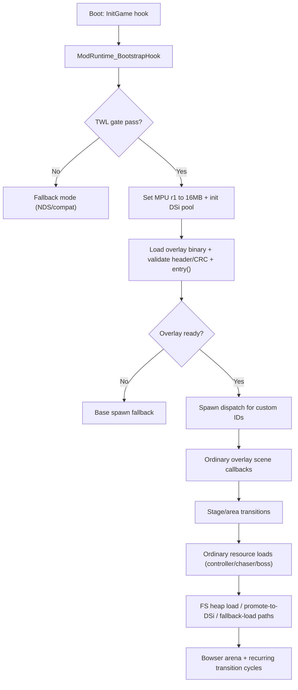

# DSi RAM Mode Conformance Review (NitroDevDocs + GBATEK)

## Summary
This review compares the current DSi RAM mode implementation against local TWL/NITRO/Game Card documentation and GBATEK, then defines a decision-complete remediation spec.

Review focus:
1. Simplification opportunities.
2. Feasibility of a single `.nds` without patched melonDS.
3. Better conformance to documented TWL/NITRO behavior.

Reviewed code:
- `/Users/ndymario/NSMB-DS-Modding/NSMB-DSi/source/mod_runtime.cpp`
- `/Users/ndymario/NSMB-DS-Modding/NSMB-DSi/source/mod_runtime.hpp`
- `/Users/ndymario/NSMB-DS-Modding/NSMB-DSi/source/ports/Ordinary/MemoryDebug.cpp`
- Supporting behavior context:
  - `/Users/ndymario/NSMB-DS-Modding/NSMB-DSi/source/ports/Ordinary/SpookyController.cpp`
  - `/Users/ndymario/NSMB-DS-Modding/NSMB-DSi/source/ports/Ordinary/SpookyChaser.cpp`
  - `/Users/ndymario/NSMB-DS-Modding/NSMB-DSi/source/ports/Ordinary/SpookyBoss/SpookyBoss.cpp`
  - `/Users/ndymario/NSMB-DS-Modding/NSMB-DSi/source/dsi_compat_warning.cpp`

---

## Documentation Citation Index

| Rule ID | Requirement | Citation |
|---|---|---|
| TWL-R1 | DSi/TWL mode is indicated by `SCFG_A9ROM` status (`01` = TWL mode). | `TWL Programming Manual v1.4.pdf` PDF pages 25-26 (manual page 9-10). |
| TWL-R2 | `SCFG_EXT` bit `CFG[d31]` controls access to SCFG/MBK block; writing `0` disables access to `SCFG_*` and `MBK1-9`. | `TWL Programming Manual v1.4.pdf` PDF page 28 (manual page 12). |
| TWL-R3 | `SCFG_EXT` `PSRAM[d15:d14]` controls main memory limit (`16 MB` / `32 MB` options). | `TWL Programming Manual v1.4.pdf` PDF page 29 (manual page 13) and page 30 (manual page 14). |
| TWL-R4 | MBK registers define extended WRAM mapping; overlapping enabled regions have strict priority; avoid switching while RAM is being accessed. | `TWL Programming Manual v1.4.pdf` PDF pages 56, 58, 59, 65 (manual pages 40, 42, 43, 49). |
| TWL-R5 | SCFG/MBK address map for ARM9 side is fixed (`0x04004000+`). | `TWL Programming Manual v1.4.pdf` PDF pages 424-425 (manual pages 408-409). |
| NITRO-R1 | Game card boot layout has fixed bootable regions; overlays/data binaries are app-loaded. | `NITRO Programming Manual v1.62.pdf` PDF pages 53-54 (manual pages 33-34). |
| NITRO-R2 | Cache coherency must be manually managed for non-ARM9 bus masters; wait for write buffer where required. | `NITRO Programming Manual v1.62.pdf` PDF pages 63-64 (manual pages 43-44). |
| NITRO-R3 | If program image is overwritten by overlay, invalidate I-cache for the affected region. | `NITRO Programming Manual v1.62.pdf` PDF pages 64-65 (manual pages 44-45). |
| NITRO-API1 | Extended main RAM should use extended arena initialization/allocation APIs (`OS_InitArenaEx`, `OS_AllocFromMainExArena*`). | `/Users/ndymario/NSMB-DS-Modding/Nitro Stuff/nitro/os/common/arena.h:125`, `/Users/ndymario/NSMB-DS-Modding/Nitro Stuff/nitro/os/common/arena.h:333`. |
| NITRO-API2 | Cache maintenance API semantics (`DC_StoreRange`, `DC_FlushRange`, `IC_InvalidateRange`, `DC_WaitWriteBufferEmpty`). | `/Users/ndymario/NSMB-DS-Modding/Nitro Stuff/nitro/os/ARM9/cache.h:175`, `/Users/ndymario/NSMB-DS-Modding/Nitro Stuff/nitro/os/ARM9/cache.h:188`, `/Users/ndymario/NSMB-DS-Modding/Nitro Stuff/nitro/os/ARM9/cache.h:251`, `/Users/ndymario/NSMB-DS-Modding/Nitro Stuff/nitro/os/ARM9/cache.h:375`. |
| NITRO-API3 | File I/O canonical sequence (`FS_ConvertPathToFileID`, `FS_OpenFileFast`, `FS_ReadFile`, `FS_CloseFile`). | `/Users/ndymario/NSMB-DS-Modding/Nitro Stuff/nitro/fs/file.h:507`, `/Users/ndymario/NSMB-DS-Modding/Nitro Stuff/nitro/fs/file.h:519`, `/Users/ndymario/NSMB-DS-Modding/Nitro Stuff/nitro/fs/file.h:595`, `/Users/ndymario/NSMB-DS-Modding/Nitro Stuff/nitro/fs/file.h:531`. |
| NITRO-API4 | Overlay lifecycle should use FS overlay APIs (`FS_LoadOverlayInfo`, `FS_LoadOverlayImage`, `FS_StartOverlay`, `FS_LoadOverlay`, `FS_AttachOverlayTable`). | `/Users/ndymario/NSMB-DS-Modding/Nitro Stuff/nitro/fs/overlay.h:119`, `/Users/ndymario/NSMB-DS-Modding/Nitro Stuff/nitro/fs/overlay.h:200`, `/Users/ndymario/NSMB-DS-Modding/Nitro Stuff/nitro/fs/overlay.h:227`, `/Users/ndymario/NSMB-DS-Modding/Nitro Stuff/nitro/fs/overlay.h:266`, `/Users/ndymario/NSMB-DS-Modding/Nitro Stuff/nitro/fs/overlay.h:290`. |
| GC-R1 | TWL-enhanced/TWL cards include header2/security2/game2 regions; game2 readable only by TWL unit. | `Nintendo DS - DSi Enhanced - DSi Game Card Manual v2.02.pdf` PDF pages 9-13. |
| GC-R2 | TWL card/twl-enhanced ROM composition and restrictions differ from DS card assumptions. | `Nintendo DS - DSi Enhanced - DSi Game Card Manual v2.02.pdf` PDF pages 6-7, 9-13. |
| GBK-R1 | SCFG/MBK register semantics and `SCFG_EXT9` bit behavior align with TWL docs; bit14-15 affect main RAM mapping. | `/Users/ndymario/NSMB-DS-Modding/GBATEK NDS Docs.html:24292`, `/Users/ndymario/NSMB-DS-Modding/GBATEK NDS Docs.html:24329`, `/Users/ndymario/NSMB-DS-Modding/GBATEK NDS Docs.html:27756`, `/Users/ndymario/NSMB-DS-Modding/GBATEK NDS Docs.html:27807`. |

---

## Current Behavior Map

### Control Points and Hooks
| Control point | Role | Location |
|---|---|---|
| `ModRuntime_BootstrapHook` (`ncp_hook(0x02005044)`) | DSi gate, MPU clamp, extra RAM probe, overlay load entry. | `/Users/ndymario/NSMB-DS-Modding/NSMB-DSi/source/mod_runtime.cpp:802` |
| `ModRuntime_SpawnDispatch` (`ncp_call(0x0204c93c)`) | Overlay custom object dispatch/fallback. | `/Users/ndymario/NSMB-DS-Modding/NSMB-DSi/source/mod_runtime.cpp:886` |
| BootScene switch hooks | Scene event telemetry and compat warning. | `/Users/ndymario/NSMB-DS-Modding/NSMB-DSi/source/dsi_compat_warning.cpp:31`, `/Users/ndymario/NSMB-DS-Modding/NSMB-DSi/source/dsi_compat_warning.cpp:36` |
| `FS_Cache_CacheEntry_loadFile_OVERRIDE` | Heap/OOM logging + Bowser-specific DSi fallback load. | `/Users/ndymario/NSMB-DS-Modding/NSMB-DSi/source/ports/Ordinary/MemoryDebug.cpp:83` |
| `FS_Cache_CacheEntry_loadFileToOverlay_OVERRIDE` | Overlay heap telemetry only. | `/Users/ndymario/NSMB-DS-Modding/NSMB-DSi/source/ports/Ordinary/MemoryDebug.cpp:174` |
| `Heap_allocate_OVERRIDE` | Global heap OOM and low-memory telemetry. | `/Users/ndymario/NSMB-DS-Modding/NSMB-DSi/source/ports/Ordinary/MemoryDebug.cpp:199` |

### File Lifecycle States
1. Normal heap load:
`FS::Cache::loadFile()` path and standard game FS cache entry load path.
2. Promote-to-DSi:
`ModRuntime_LoadValidatedFile()` copies heap-loaded file to DSi pool and unloads cache entry.
`/Users/ndymario/NSMB-DS-Modding/NSMB-DSi/source/mod_runtime.cpp:689`
3. Fallback-load:
OOM in `MemoryDebug.cpp` performs targeted direct file read to DSi pool for real file ID 1529 only.
`/Users/ndymario/NSMB-DS-Modding/NSMB-DSi/source/ports/Ordinary/MemoryDebug.cpp:96`
4. Overlay-load:
Separate FS cache overlay path + custom runtime overlay binary loader.

### Allocator Semantics (DSi pool)
- Base: `0x02C10000`, size: `0x003F0000` (bump allocator, no free).
- Cursor only grows; reset API exists:
`ModRuntime_ExtraRamReset()`.
- No production call sites found for reset API.
`/Users/ndymario/NSMB-DS-Modding/NSMB-DSi/source/mod_runtime.cpp:771`

### Ordinary Graphics Resource Paths
- Static: `/z_new/Ordinary/actors/Chaser_Static.nsbtx`
`/Users/ndymario/NSMB-DS-Modding/NSMB-DSi/source/ports/Ordinary/SpookyController.cpp:52`
- Chaser: `/z_new/Ordinary/actors/Chaser_L.nsbtx`, `/z_new/Ordinary/actors/Chaser_M.nsbtx`
`/Users/ndymario/NSMB-DS-Modding/NSMB-DSi/source/ports/Ordinary/SpookyChaser.cpp:27`
- Boss model/anim:
`/z_new/Ordinary/actors/spookyBossLuigi.nsbmd`
`/z_new/Ordinary/actors/spookyBossLuigiIdle.nsbca`
`/Users/ndymario/NSMB-DS-Modding/NSMB-DSi/source/ports/Ordinary/SpookyBoss/SpookyBoss.cpp:49`

### Call Flow

---

## Gap Analysis (Rule-by-Rule)

| Rule ID | Current implementation | Status | Risk | Impact |
|---|---|---|---|---|
| TWL-R1 | Checks `SCFG_A9ROM==1` before DSi mode. | Pass | Low | Correct gating behavior. |
| TWL-R2 | Reads `SCFG_EXT9` bit31 and RAM limit bits, but does not own full SCFG/MBK configuration lifecycle. | Partial | High | Relies on environment/emulator state; fragile portability. |
| TWL-R3 | Enforces `RAM_LIMIT >= 2` and MPU update to 16 MB. | Partial | Medium | Correct gate, but does not ensure full mapping ownership. |
| TWL-R4 | Uses fixed pool at `0x02C10000` without explicit MBK programming or ownership checks. | Fail | High | Wrong mapping on some runtimes can corrupt memory or alias regions. |
| NITRO-R1 | Overlay/data loaded by app logic. | Pass | Low | Conceptually aligned. |
| NITRO-R2 | Performs cache operations but never calls write-buffer drain before cross-bus consumers. | Partial | High | Can manifest as intermittent texture/model corruption. |
| NITRO-R3 | Overlay image path does `DC_FlushRange + IC_InvalidateRange`. | Pass | Medium | Correct for overlay image, but not generalized across all code mutation paths. |
| NITRO-API1 | Extended memory uses custom bump allocator; `OS_InitArenaEx`/`OS_AllocFromMainExArena*` not used. | Fail | Medium | Diverges from SDK lifecycle integration and introspection. |
| NITRO-API3 | Uses a mix of internal hardcoded FS call signatures and cache internals. | Partial | Medium | ABI fragility and harder maintenance. |
| NITRO-API4 | Custom overlay binary format/loader instead of FS overlay API pipeline. | Partial | Medium | Extra correctness burden and duplicate logic (clear/init/cache/start). |
| GC-R1 | Current build/runtime depends on patched emulator path for TWL-like mode; not true TWL card flow. | Fail (for stock flow) | High | Single ROM portability limited. |
| GBK-R1 | Register assumptions mostly match GBATEK, but MBK ownership/config sequencing is incomplete. | Partial | High | Runtime-dependent behavior and hard-to-diagnose faults. |

---

## Simplification Review

### 1) Consolidate loaders behind one API surface
Current:
- `ModRuntime_LoadValidatedFile` in runtime.
- `FS_Cache_CacheEntry_loadFile_OVERRIDE` in Ordinary-specific debug file with custom fallback logic.

Target:
- One shared loader API (`DsiMem`) used by runtime and Ordinary modules.

### 2) Remove per-module special cases
Current:
- Hardcoded Bowser fallback file ID (`1529`) and per-module reuse globals.

Target:
- Policy table keyed by file class/range/magic and scene lifetime, not actor-specific magic numbers.

### 3) Centralize state ownership
Current:
- Promotion table and bump allocator in runtime.
- Additional promoted tracking + fallback globals in `MemoryDebug.cpp`.

Target:
- Single ownership object:
`DsiMemState { pool, promotions, policy, stats, lifecycle }`.

### 4) Define minimal target architecture
Proposed interfaces:
- `DsiMemLoadResult DsiMem_LoadByPath(const char* path, u32 expectedMagic, DsiMemLoadClass cls)`
- `DsiMemLoadResult DsiMem_LoadByExtId(u32 extFileId, u32 expectedMagic, DsiMemLoadClass cls)`
- `void DsiMem_OnAreaEnter(u16 sceneId)`
- `void DsiMem_OnAreaLeave(u16 sceneId)`
- `void DsiMem_OnOverlayUnload()`
- `DsiMemStatsSnapshot DsiMem_GetStats()`

---

## Public API / Type Additions (Implementation Spec)

### `DsiMem` centralized API
- Namespace/module: `source/dsi_mem.*`
- Runtime-facing functions:
  - `bool DsiMem_Init(const DsiMemConfig* cfg)`
  - `void DsiMem_Reset(DsiMemResetMode mode)`
  - `DsiMemLoadResult DsiMem_LoadByPath(...)`
  - `DsiMemLoadResult DsiMem_LoadByExtId(...)`

### `DsiMemFilePolicy`
- Defines promotion/fallback behavior by:
  - file class (`Texture`, `Model`, `Anim`, `OverlayData`, `Transient`)
  - size thresholds
  - persistence scope (`Area`, `Stage`, `Session`)
  - validation requirements (`expected_magic`, setup3D requirement)

### `DsiMemStatsSnapshot`
- Deterministic telemetry structure:
  - alloc totals, fail counts, bytes in-use, bytes reusable
  - promotion count, eviction/reclaim count
  - last load path/ext id, source (`heap/promoted/fallback`)

### Lifecycle hooks
- `OnAreaEnter`, `OnAreaLeave`, `OnOverlayUnload` events wired into existing scene hooks.

---

## Conformance Remediation Backlog

### P0 (Correctness / Crash)
1. Integrate lifecycle reset policy:
- Files: `mod_runtime.cpp`, `dsi_compat_warning.cpp`, Ordinary stage transition hooks.
- Change: invoke centralized DSi memory lifecycle on area transitions and overlay shutdown.
- Rule refs: NITRO-R2, TWL-R4.
- Validation: repeated area transitions + Bowser entry loop without corruption/OOM drift.
- Rollback: compile-time flag to restore old behavior.

2. Remove direct cache-entry mutation path in `MemoryDebug.cpp` (`self->heap = nullptr` side path) and migrate to central loader bookkeeping.
- Files: `MemoryDebug.cpp`, new `dsi_mem.*`.
- Rule refs: NITRO-API3.
- Validation: no invalid frees, stable cache behavior across reloads.

3. Add write-buffer drain at required boundaries after D-cache writes when handing buffers to other masters.
- Files: `mod_runtime.cpp`, `MemoryDebug.cpp` (if retained path).
- Rule refs: NITRO-R2, NITRO-API2.
- Validation: texture/model corruption soak tests.

### P1 (Data Integrity / Rendering)
4. Replace ad-hoc fallback ID policy with `DsiMemFilePolicy`.
- Files: `MemoryDebug.cpp`, `Spooky*` loaders.
- Rule refs: simplification targets + NITRO-API3.
- Validation: Ordinary assets load consistently without per-file hacks.

5. Normalize overlay load path decisions:
- Keep custom `ordinaryovl.bin` format only if required, otherwise adopt FS overlay APIs.
- Files: `mod_runtime.cpp`, overlay build pipeline.
- Rule refs: NITRO-API4.
- Validation: overlay load/unload cycles; ABI compatibility checks.

### P2 (Maintainability / Documentation)
6. Migrate fixed DSi bump allocator to SDK-style arena integration where feasible (`OS_InitArenaEx` + MainEx allocations).
- Files: `mod_runtime.cpp`, new allocator module.
- Rule refs: NITRO-API1.

7. Correct docs and repo metadata mismatch:
- `AGENTS.md` path typo (`NitroDevDocks` vs `NitroDevDocs`).
- File: `/Users/ndymario/NSMB-DS-Modding/NSMB-DSi/AGENTS.md`.

---

## Migration Sequence (Low-Risk Order)
1. Introduce `DsiMem` API + stats type behind old call signatures.
2. Route `ModRuntime_LoadValidatedFile` through `DsiMem`.
3. Route `MemoryDebug.cpp` fallback/promote paths through `DsiMem` policy (remove actor-specific branches).
4. Wire lifecycle events (`switch area`, stage destroy, overlay shutdown) to `DsiMem_Reset`.
5. Add cache coherency hardening (`DC_WaitWriteBufferEmpty` where required).
6. Evaluate overlay loader migration to FS overlay APIs.
7. Retire duplicate state and dead compatibility branches.

---

## Test Cases and Acceptance Criteria

1. Boot gate matrix:
- Conditions: patched melonDS, unpatched melonDS, and NDS mode.
- Pass: mode and logs match gate expectations.

2. Area transition soak:
- Enter/exit multiple areas with static/chaser visible.
- Pass: no texture corruption, no data aborts, deterministic memory stats.

3. Bowser arena repeated entry:
- Pass: boss always spawns, no load failure for large assets, no fallback-only regressions.

4. File ID regression set:
- Include historically problematic IDs (`1529`, `1860`, `1893`, `1897`, Ordinary assets).
- Pass: no recurring OOM when policy should promote/reuse safely.

5. Overlay load/unload loop:
- Pass: no stale pointers after scene switches; callbacks consistent.

6. Long-run stability:
- 30+ transitions with periodic spooky/chaser/boss events.
- Pass: no monotonic leak in DSi pool usage beyond policy scope.

7. Low-memory deterministic behavior:
- Force near-OOM and verify fallback/policy outcomes are intentional and logged.

---

## Assumptions and Defaults
1. Docs used as source of truth: local TWL/NITRO/Game Card manuals + GBATEK + Nitro headers.
2. This review is spec-only and does not patch runtime behavior.
3. Default target architecture: single shared DSi memory loader with explicit lifecycle and policy.
4. When current behavior conflicts with docs, docs win unless compatibility exception is explicitly documented.

